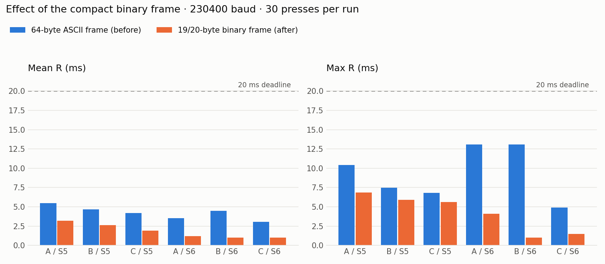
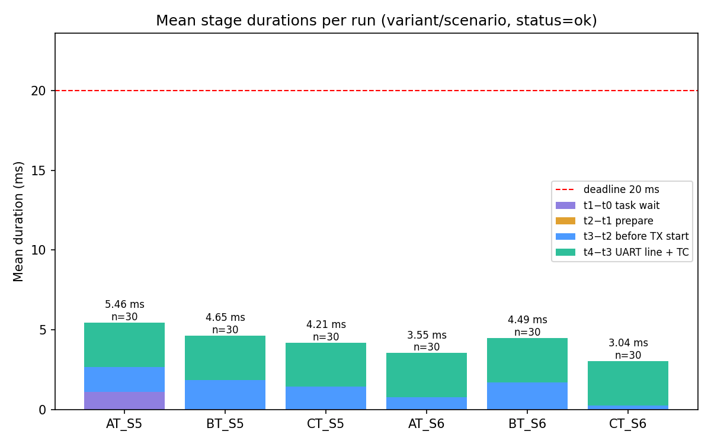
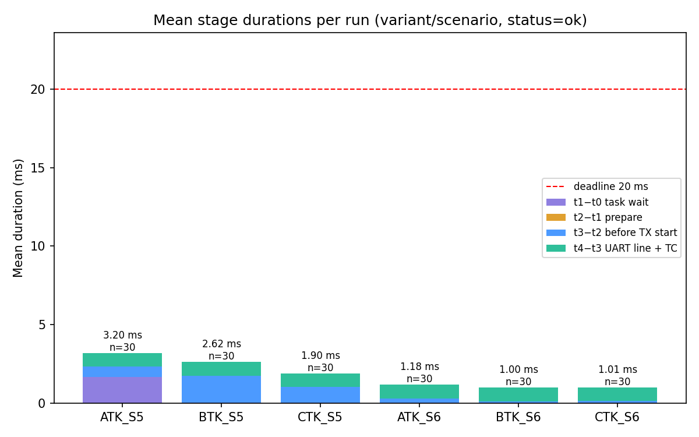
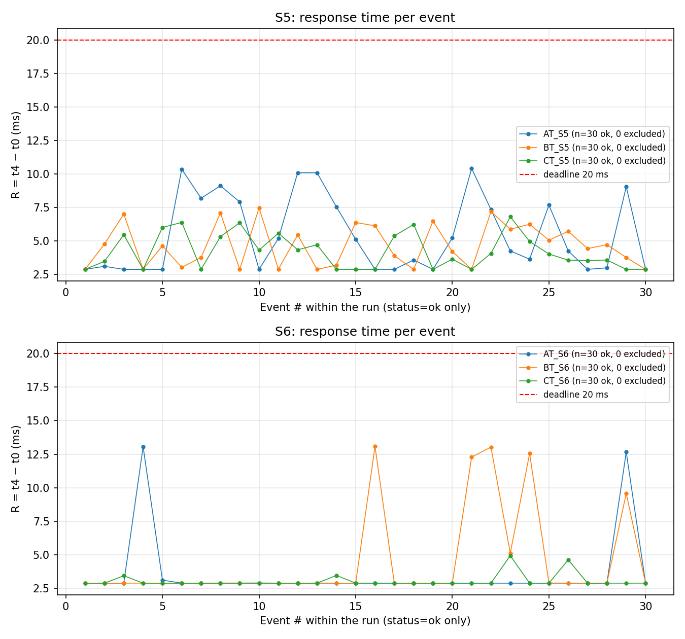
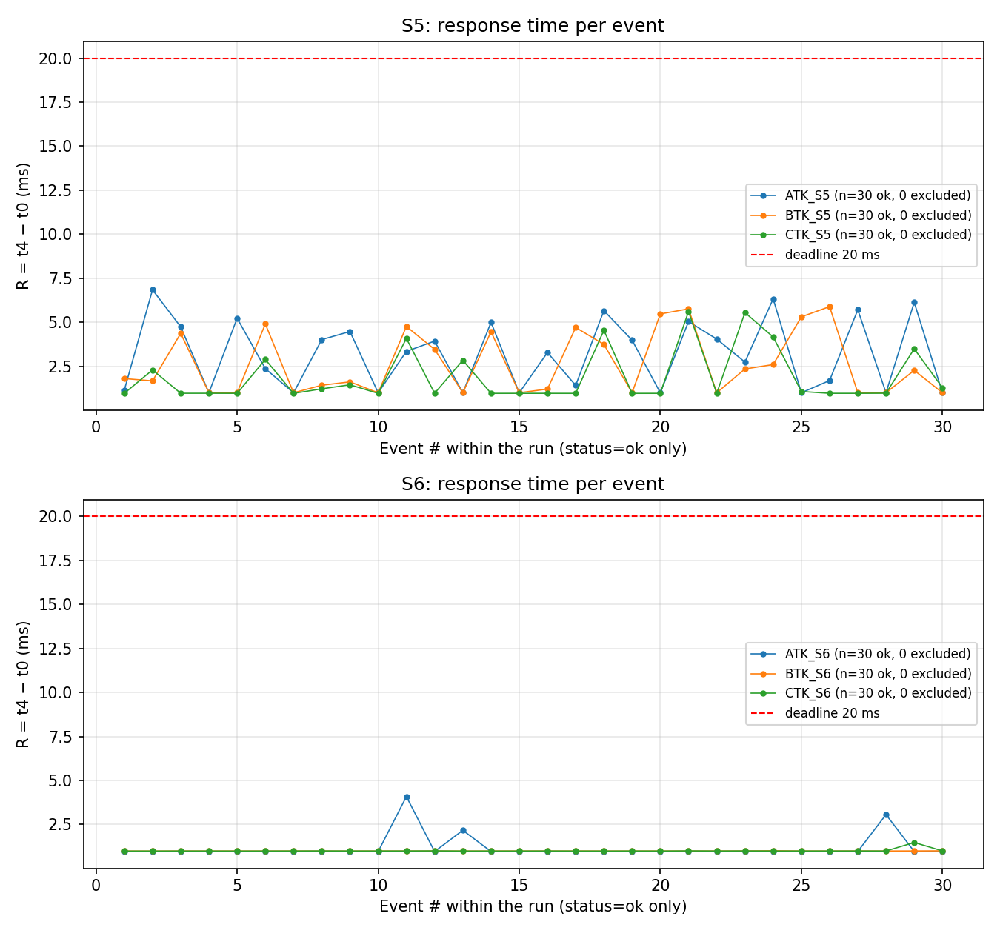
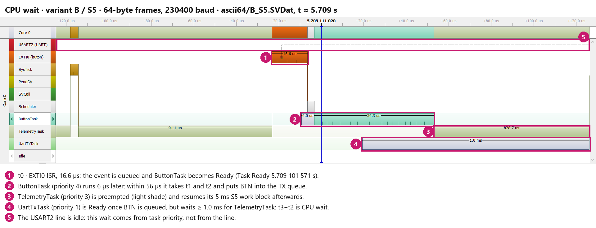
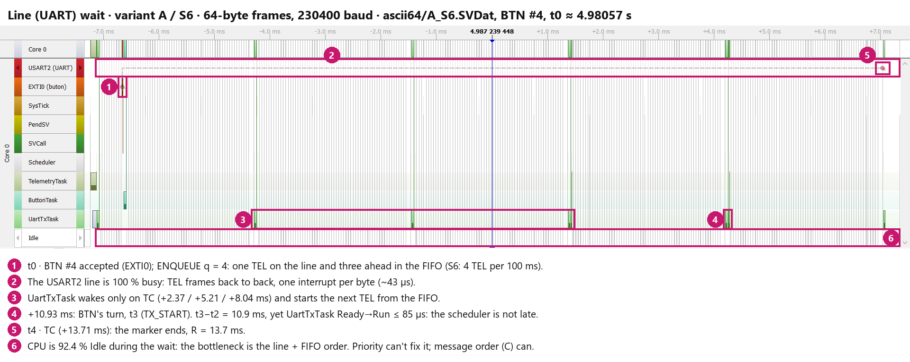
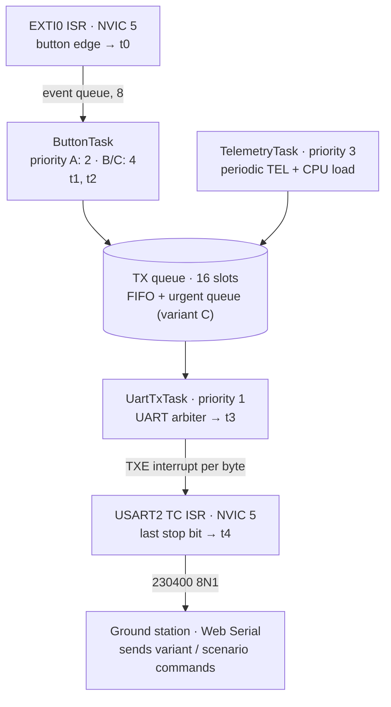

# PressTrace · sched

**Button → UART latency under load on STM32F407 + FreeRTOS: does task priority or message order decide the worst case?**

[](https://github.com/ardagmrkc/presstrace-sched/actions/workflows/ci.yml)


[Türkçe](README.tr.md) · [Design notes](docs/design.md) · [Measurement data](measurements/README.md)

A button press has to reach the UART while the same MCU is busy with periodic telemetry: a CPU-heavy task, bursts
of outgoing frames, or both. This project measures how long that takes, end to end, with microsecond timestamps.
It changes one scheduling decision at a time and uses SEGGER SystemView traces to explain every millisecond of the
result.

<p align="center"></p>

## At a glance

- **What is measured:** R = t4 − t0, from the accepted button edge (EXTI0 ISR) to the last stop bit of the reply
  leaving the UART (TC interrupt). All five timestamps come from one 1 MHz hardware timer, so the stages add up
  exactly.
- **Data:** 360 presses in 12 runs. All 360 were delivered, with 0 drops, 0 timeouts, no response over 20 ms and no
  telemetry frame lost.
- **Finding 1:** Raising the button task's priority does not remove the wait, it **moves** it. Under CPU load
  (S5), the wait shifts from "button task waits for the CPU" to "UART task waits for the CPU".
- **Finding 2:** Under bursty traffic (S6), the CPU is 92 % idle while the button reply waits. The bottleneck is the
  UART line and the FIFO order, which task priority cannot change. Letting button messages jump the queue at frame
  boundaries cuts worst-case R in S6 from **13.1 ms to 4.9 ms**.
- **Finding 3:** Replacing 64-byte ASCII frames with 19/20-byte binary frames (CRC-8) cut worst-case R in A/S6 from
  **13.06 ms to 4.08 ms**. The prediction made before the change was ~4.2 ms.
- **Verification:**
  - The SystemView trace and the board's own log agree to −1…0 µs on all 120 presses compared.
  - Every summary in this repository is recomputed from the raw logs in CI.

## Experiment

**Three scheduling variants.** All three run from one firmware image and are switched at run time from the ground
station:

| Variant | ButtonTask | TelemetryTask | UartTxTask | TX queue order |
|---|---|---|---|---|
| **A** | 2 | 3 | 1 | one FIFO |
| **B** | **4** | 3 | 1 | one FIFO |
| **C** | **4** | 3 | 1 | button messages first, at frame boundaries |

**Two load scenarios:**

| Scenario | Telemetry | What it stresses |
|---|---|---|
| **S5** | 100 Hz, each period runs ~5 ms of CPU work | CPU (≥ 50 % busy) |
| **S6** | 10 Hz, 4 frames back to back per period | UART line (burst queueing) |

**Constraints for every run:**
- at most 16 pending TX messages;
- UART at 230400 8N1;
- 30 presses per run, ≥ 0.5 s apart, after a 5 s warm-up;
- tracing compiled in, so its overhead is included in every number.

## Results

Response time R in ms, 30 presses per run:

| Run | 64-byte ASCII: mean | p95 | max | Compact binary: mean | p95 | max |
|---|---:|---:|---:|---:|---:|---:|
| A / S5 | 5.46 | 10.23 | 10.41 | 3.20 | 6.24 | 6.84 |
| B / S5 | 4.64 | 7.14 | 7.47 | 2.63 | 5.63 | 5.89 |
| C / S5 | 4.21 | 6.36 | 6.80 | 1.90 | 5.10 | 5.61 |
| A / S6 | 3.55 | 8.36 | **13.06** | 1.18 | 2.66 | **4.08** |
| B / S6 | 4.49 | 12.81 | 13.08 | 1.00 | 1.00 | 1.01 |
| C / S6 | 3.04 | 4.09 | 4.93 | 1.01 | 1.00 | 1.48 |

Where the time goes. These are stage means from the 64-byte runs; the full table is in
[`measurements/*/summary.csv`](measurements/ascii64/summary.csv):

| Change | Effect |
|---|---|
| **A → B** (button task 2 → 4), S5 | t1−t0 drops from 1.114 to 0.018 ms. The wait reappears in t3−t2 (1.560 → 1.844 ms), because UartTxTask (priority 1) still waits for the 5 ms telemetry work. |
| **B → C** (button messages first), S6 | t3−t2 drops from 1.685 to 0.235 ms; worst-case R from 13.08 to 4.93 ms. Cost to telemetry: the worst-case TEL queue wait rises from 11 356 to 11 362 µs. |
| **ASCII → binary frame**, S6 | Each frame occupies the line 2.77 → 0.82 ms. The wait behind a 4-frame burst shrinks by the same factor. |
| **ASCII → binary frame**, B/S5 | t3−t2 only goes from 1.84 to 1.72 ms. This wait is CPU, not line, and frame size cannot fix it. |

**Mean stage durations per run.** Purple is ButtonTask's CPU wait (t1−t0), blue is TX-queue and CPU wait before the
transfer (t3−t2), and green is the frame on the wire (t4−t3).

<table>
  <tr>
    <td width="50%"></td>
    <td width="50%"></td>
  </tr>
  <tr>
    <td align="center">64-byte ASCII frames</td>
    <td align="center">Compact binary frames</td>
  </tr>
</table>

<details>
<summary><b>Response time of every press</b> (click to expand)</summary>
<br>
<table>
  <tr>
    <td width="50%"></td>
    <td width="50%"></td>
  </tr>
  <tr>
    <td align="center">64-byte ASCII frames</td>
    <td align="center">Compact binary frames</td>
  </tr>
</table>

The spikes in S6 are presses that landed on a 4-frame telemetry burst; the rest wait only for their own frame.
</details>

## What the traces show

The rule used to tell the waits apart: **if the Idle task runs during the wait, the CPU is free and the bottleneck
is the line or the queue.**

**CPU wait (B/S5).** ButtonTask runs 6 µs after the interrupt. UartTxTask is Ready but cannot run until the 5 ms
telemetry block finishes, while the line stays idle.



**Line wait (A/S6).** The button reply sits behind three telemetry frames. UartTxTask wakes within 85 µs of every
TC, so the scheduler is not late. The CPU is 92.4 % idle, so the line is the bottleneck.



## System overview



| Stage | Interval | Dominated by |
|---|---|---|
| t1 − t0 | ISR → ButtonTask running | ButtonTask's CPU wait (variant A) |
| t2 − t1 | build the BTN message | ≈ 2 µs |
| t3 − t2 | TX queue → transfer starts | queue order, UartTxTask's CPU wait, line busy |
| t4 − t3 | frame on the wire | frame length: 2.77 ms (64 B) / 0.87 ms (20 B) |

## Engineering highlights

- **Static allocation only.** No heap: every task, queue and semaphore is a static object. All 30 407 B of RAM is
  accounted for in the linker map, and 16 KB of that is the trace buffer.
- **A UART arbiter with explicit invariants.**
  - One owner variable is shared by two same-priority ISRs and one task under BASEPRI.
  - Transfer tags stop a late TC interrupt from being taken as the next frame's timestamp.
  - TC is cleared at start and enabled only after the last byte.
  - See [design notes §4](docs/design.md#4-uart-arbiter).
- **A shared 16-slot limit across two queues.** Two counting semaphores replace a queue set. The receiver selects
  the next message in a single critical section; variant C differs only in which queue a button message enters.
- **Measurement integrity.**
  - Every ISR takes its timestamp before calling any trace hook, and trace events follow their measurement points.
  - Results stay in RAM during a run and are dumped after it, so reporting does not disturb the measurement.
- **Stacks sized from evidence.** IAR static stack analysis is guided by a `.suc` control file for task roots and
  SEGGER callbacks, then cross-checked with on-target high-water marks.
- **Tested off target.** The real driver sources are compiled against register and RTOS mocks on the host: the
  debounce filter, the TX-queue rule and the UART arbiter in both frame formats. CI runs them on every push.

## Bugs found by measuring

1. **Button presses occasionally lost.**
   - Cause: the debounce filter decided press or release from the pin level at the first edge. When the ISR ran
     late, behind a UART interrupt, it sampled a bounce and dropped the press.
   - Fix: take the direction from the level that had settled before the edge group, and clear the pending flag
     before sampling.
   - Proof: the host test replays delayed-ISR sequences. The old filter lost presses in 4 of 8 scenarios, the new
     one in 0.
2. **The trace stream froze after 0.1–0.4 s.**
   - How it was found: reading the RTT control block live over SWD, without halting the CPU, and decoding the raw
     stream.
   - Cause: a `#` in the SystemView module description, which SystemView's syntax treats as the start of a comment.
3. **The first line after reset was sometimes corrupt.**
   - Cause: PA2 was switched to UART before the transmitter was enabled, and the glitch merged into the boot
     message.
   - Fix: enable the transmitter first. The ground station now also recovers from a merged line and re-queries the
     board state.
4. **The recording tool dropped events.**
   - Cause: a second J-Link session opened during recording starved the RTT reader. Dropped-event counts were also
     summed, although SystemView reports them cumulatively.
   - Fix: the custom recorder opens no session while recording and computes the difference instead.

## Repository layout

```
firmware/
  Core/            application: tasks, drivers, protocol, tracing hooks
  EWARM/           IAR project, linker script, stack-analysis control file (.suc)
  Middlewares/     FreeRTOS kernel (only the files this build uses), SEGGER SystemView + RTT
  Drivers/CMSIS/   CMSIS core and STM32F4 device headers
interface/         ground station (single HTML page, Web Serial): run control, live view, CSV export
measurements/      raw logs, per-press CSVs, counters, summaries, experiment log  → measurements/README.md
analysis/          analyze.py, compare_frames.py, sysview_record.py, plots, SystemView traces (.SVDat)
tests/host/        host-side unit tests with register / RTOS mocks
docs/              design notes and figures
```

## Reproduce

**Hardware:**
- STM32F407G-DISC1 board.
- A 3.3 V USB-TTL adapter: board PA2 (TX) → adapter RX, PA3 (RX) ← adapter TX, common GND.
- Optional, for traces: a J-Link. The on-board ST-LINK can be converted with SEGGER's STLinkReflash.

**Firmware:** open `firmware/EWARM/presstrace_sched.eww` in IAR Embedded Workbench for Arm 9.70 and build `Debug`,
or build from the command line:

```bash
iarbuild firmware/EWARM/presstrace_sched.ewp -build Debug
```

Build-time switches:
- `PROTOCOL_COMPACT` in `firmware/Core/Inc/protocol.h` selects the frame format.
- `USE_SYSVIEW` in `firmware/Core/Inc/FreeRTOSConfig.h` enables tracing.

**Ground station:**
1. Open `interface/index.html` in Chrome or Edge (Web Serial) and connect.
2. Pick a variant and a scenario.
3. Press the button 30 times, after the warm-up.
4. Choose *Ölçümü bitir* (end measurement) and export the CSVs.

The UI is in Turkish.

**Analysis:**

```bash
pip install -r analysis/requirements.txt
python analysis/analyze.py          # summaries + plots for measurements/ascii64 and measurements/compact
python analysis/compare_frames.py   # analysis/plots/before_after.png
```

**Host tests:**

```bash
gcc -std=c11 -Wall -Wextra -I tests/host/mock_btn -I firmware/Core/Inc tests/host/test_button_filter.c firmware/Core/Src/button.c -o test_button_filter && ./test_button_filter
```

The other three test builds are in [`.github/workflows/ci.yml`](.github/workflows/ci.yml).

**Traces:** close the SystemView app, then run the recorder. Open the result in SystemView with *File → Load Recording*.

```bash
python analysis/sysview_record.py B_S6 --sure 40
```

## Limitations

- **No worst-case guarantee.** Thirty presses per run give a distribution, not a WCET bound. All runs use one board
  and a Debug build.
- **Tracing is part of every number.** It was compiled into every run; a trace-off comparison with the same image is
  still to be measured.
- **Two runs carry data-quality notes:** board resets inside the window. They are flagged in
  [`measurements/experiment_log.csv`](measurements/experiment_log.csv) instead of being silently re-recorded.
- **Minor source/binary differences:**
  - The compact-frame runs were measured with this source. The only differences are comments and the SystemView
    application-name string; code and data sizes are identical.
  - The ASCII runs were recorded earlier with `PROTOCOL_COMPACT=0` and the same 64-byte path.
  - SystemView shows the name embedded at recording time when the traces are opened.
- **Known open item:** a minor read-modify-write race on the UART status register. It is described, with its fix,
  in [design notes §9](docs/design.md#9-known-limitations-and-next-steps).

## PressTrace series

| Part | Repository | Focus |
|---|---|---|
| 1 | [presstrace-stm32](https://github.com/ardagmrkc/presstrace-stm32) | Button → UART response time under load, measurement chain |
| 2 | [presstrace-fastpath](https://github.com/ardagmrkc/presstrace-fastpath) | ISR fast path and UART arbiter |
| 3 | **presstrace-sched** | Task priority vs. message order, SystemView traces, compact framing |

## Development notes

- Source comments and the ground-station UI are in Turkish.
- Parts of the code, the host-test harnesses and the analysis scripts were written with an AI coding assistant
  (Claude Code). Design decisions were reviewed by hand. Every claim in this README is backed by a host test or by
  on-target measurements stored in this repository.

## License

The project code is MIT ([LICENSE](LICENSE)). Third-party sources keep their own licenses:
- FreeRTOS kernel: MIT.
- SEGGER SystemView/RTT: SEGGER BSD-style.
- CMSIS and the ST device files: Apache-2.0.
