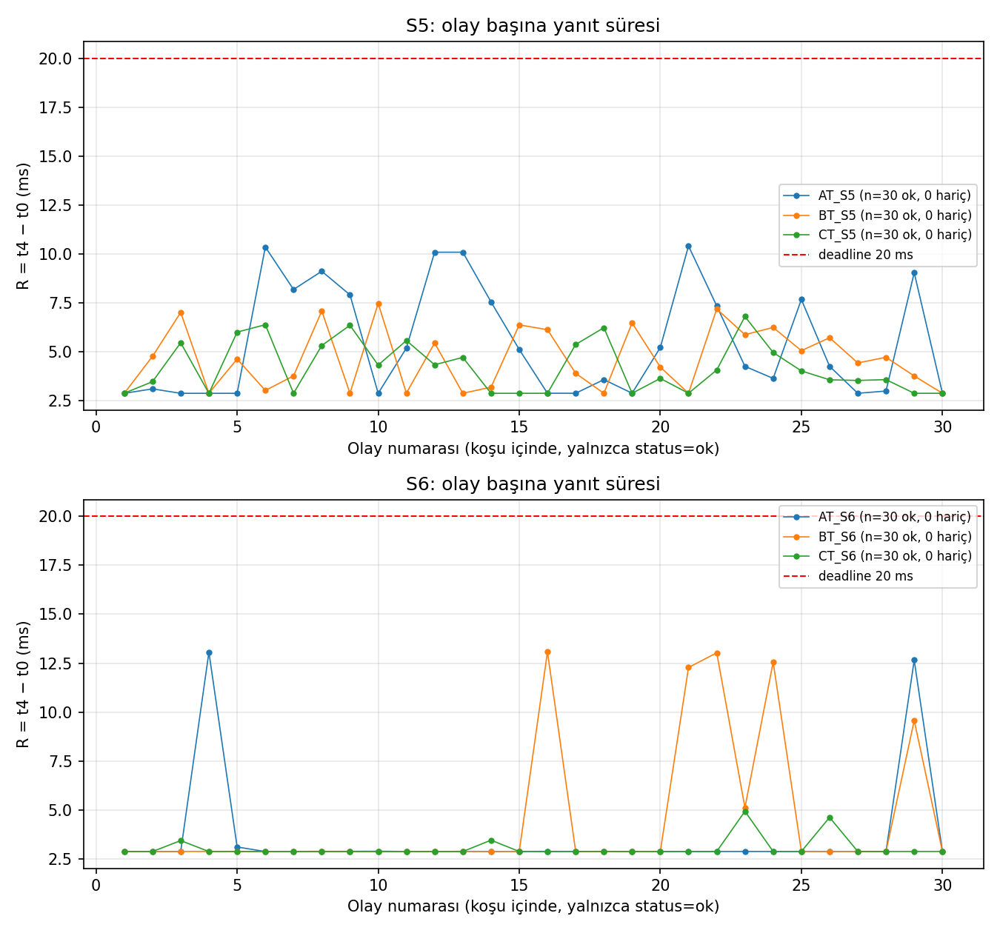
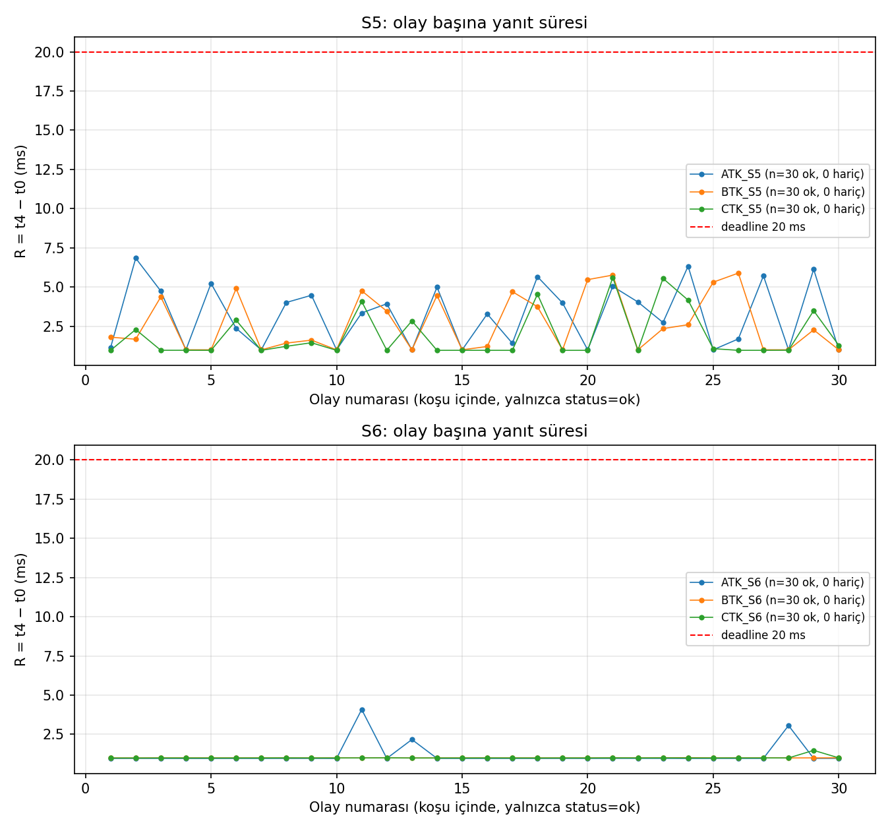
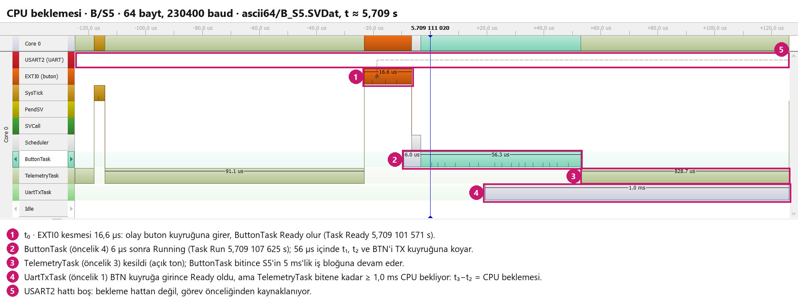
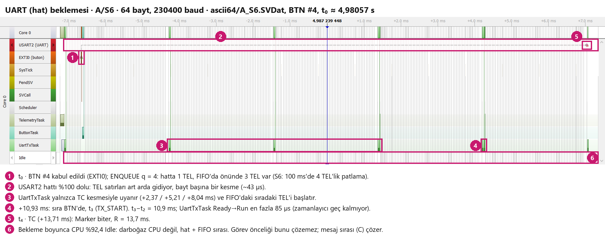
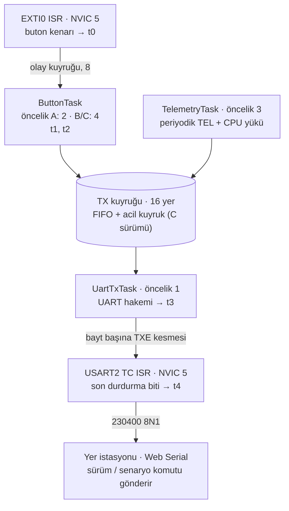

# PressTrace · sched

**STM32F407 + FreeRTOS'ta yük altında buton → UART gecikmesi: en kötü durumu görev önceliği mi belirler, mesaj
sırası mı?**

[](https://github.com/ardagmrkc/presstrace-sched/actions/workflows/ci.yml)


[English](README.md) · [Tasarım notları (EN)](docs/design.md) · [Ölçüm verisi (EN)](measurements/README.md)

Bir buton basışı, aynı mikrodenetleyici periyodik telemetriyle meşgulken UART'a ulaşmak zorunda. Meşguliyet CPU'yu
yoran bir görev, art arda giden çerçeveler ya da ikisi birden olabilir. Bu proje basıştan hattaki son bite kadar
geçen süreyi mikrosaniye çözünürlükle ölçer. Her seferinde tek bir zamanlama kararını değiştirir ve sonucun her
milisaniyesini SEGGER SystemView izleriyle açıklar.

<p align="center"></p>

## Özet

- **Ölçülen büyüklük:** R = t4 − t0. Kabul edilen buton kenarından (EXTI0 kesmesi) yanıtın son durdurma bitinin
  hattan çıkmasına (TC kesmesi) kadar geçen süredir. Beş zaman damgasının hepsi tek bir 1 MHz donanım
  zamanlayıcısından gelir; aşamalar birebir toplanır.
- **Veri:** 12 koşuda 360 basış. 360'ı da ulaştı: 0 kayıp, 0 zaman aşımı, 20 ms'yi aşan yanıt yok, kaybolan
  telemetri çerçevesi yok.
- **Bulgu 1:** Buton görevinin önceliğini artırmak beklemeyi **kaldırmıyor, yerini değiştiriyor**. CPU yükü altında
  (S5) bekleme "buton görevi CPU bekliyor"dan "UART görevi CPU bekliyor"a kayıyor.
- **Bulgu 2:** Patlamalı trafikte (S6) buton yanıtı beklerken CPU %92 boş. Darboğaz UART hattı ve FIFO sırası;
  görev önceliği bunu değiştiremez. Buton mesajlarının çerçeve sınırında öne geçmesi, S6'da en kötü R'yi
  **13,1 ms'den 4,9 ms'ye** indirdi.
- **Bulgu 3:** 64 baytlık ASCII yerine 19/20 baytlık ikili çerçeve (CRC-8) A/S6'da en kötü R'yi **13,06 ms'den
  4,08 ms'ye** indirdi. Değişiklikten önceki tahmin ~4,2 ms idi.
- **Doğrulama:**
  - SystemView izi ile kartın kendi kaydı karşılaştırılan 120 basışın hepsinde −1…0 µs içinde örtüşüyor.
  - Depodaki her özet CI'da ham kayıtlardan yeniden hesaplanıyor.

## Deney

**Üç zamanlama sürümü.** Üçü de aynı firmware'de; yer istasyonundan çalışırken seçilir:

| Sürüm | ButtonTask | TelemetryTask | UartTxTask | TX kuyruğu sırası |
|---|---|---|---|---|
| **A** | 2 | 3 | 1 | tek FIFO |
| **B** | **4** | 3 | 1 | tek FIFO |
| **C** | **4** | 3 | 1 | buton mesajları önce, çerçeve sınırında |

**İki yük senaryosu:**

| Senaryo | Telemetri | Neyi zorlar |
|---|---|---|
| **S5** | 100 Hz; her periyotta ~5 ms CPU işi | CPU (≥ %50 dolu) |
| **S6** | 10 Hz; periyot başına art arda 4 çerçeve | UART hattı (patlama kuyruğu) |

**Her koşuda sabit tutulanlar:**
- en fazla 16 bekleyen TX mesajı;
- UART 230400 8N1;
- koşu başına 30 basış, aralarında ≥ 0,5 s, 5 s ısınmadan sonra;
- izleme derlemeye dahil, yani maliyeti her sayının içinde.

## Sonuçlar

Yanıt süresi R (ms), koşu başına 30 basış:

| Koşu | 64 B ASCII: ort. | p95 | en büyük | Kısa ikili: ort. | p95 | en büyük |
|---|---:|---:|---:|---:|---:|---:|
| A / S5 | 5,46 | 10,23 | 10,41 | 3,20 | 6,24 | 6,84 |
| B / S5 | 4,64 | 7,14 | 7,47 | 2,63 | 5,63 | 5,89 |
| C / S5 | 4,21 | 6,36 | 6,80 | 1,90 | 5,10 | 5,61 |
| A / S6 | 3,55 | 8,36 | **13,06** | 1,18 | 2,66 | **4,08** |
| B / S6 | 4,49 | 12,81 | 13,08 | 1,00 | 1,00 | 1,01 |
| C / S6 | 3,04 | 4,09 | 4,93 | 1,01 | 1,00 | 1,48 |

| Değişiklik | Etkisi (64 B koşuların aşama ortalamaları) |
|---|---|
| **A → B** (buton görevi 2 → 4), S5 | t1−t0 1,114 ms'den 0,018 ms'ye düşüyor. Bekleme t3−t2'ye kayıyor (1,560 → 1,844 ms): UartTxTask (öncelik 1) hâlâ 5 ms'lik telemetri işini bekliyor. |
| **B → C** (önce buton), S6 | t3−t2 1,685 ms'den 0,235 ms'ye düşüyor; en kötü R 13,08'den 4,93 ms'ye. Telemetrinin bedeli: en kötü TEL kuyruk beklemesi 11 356'dan 11 362 µs'ye çıkıyor. |
| **ASCII → ikili çerçeve**, S6 | Bir çerçevenin hatta kaldığı süre 2,77 ms'den 0,82 ms'ye iniyor. 4 çerçevelik patlamanın arkasındaki bekleme de aynı oranda kısalıyor. |
| **ASCII → ikili çerçeve**, B/S5 | t3−t2 yalnızca 1,84 ms'den 1,72 ms'ye iniyor. Bu bekleme hattan değil CPU'dan; çerçeve boyu çözemez. |

**Koşu başına ortalama aşama süreleri.** Mor, ButtonTask'ın CPU beklemesi (t1−t0). Mavi, aktarımdan önceki kuyruk ve
CPU beklemesi (t3−t2). Yeşil, çerçevenin hatta geçirdiği süre (t4−t3).

<table>
  <tr>
    <td width="50%"></td>
    <td width="50%"></td>
  </tr>
  <tr>
    <td align="center">64 baytlık ASCII çerçeve</td>
    <td align="center">Kısa ikili çerçeve</td>
  </tr>
</table>

**Her basışın yanıt süresi: çerçeve değişikliğinden önce ve sonra.** Her çizgi 30 basışlık bir koşu, kırmızı çizgi
20 ms sınırı.

<table>
  <tr>
    <td width="50%"></td>
    <td width="50%"></td>
  </tr>
  <tr>
    <td align="center">64 baytlık ASCII çerçeve (önce)</td>
    <td align="center">Kısa ikili çerçeve (sonra)</td>
  </tr>
</table>

- **S6 (hat yükü).**
  - 64 baytlık çerçevede, 4 çerçevelik telemetri patlamasına denk gelen basışlar A ve B'de 9–13 ms'ye sıçrıyor.
    C bunları ~5 ms ile sınırlıyor.
  - Kısa çerçevede A'daki sıçramalar ≤ 4,1 ms'ye iniyor. B ve C ~1,0 ms'de, yani kendi çerçeve süresinde düz
    kalıyor.
- **S5 (CPU yükü).**
  - Dağılım, basışın 5 ms'lik telemetri işine göre nereye denk geldiğinden kaynaklanıyor; bu yüzden iki çerçeve
    biçiminde de sürüyor.
  - Kısa çerçeve tabanı 2,9 ms'den 1,0 ms'ye indiriyor. Bu da butonun kendi çerçeve süresi.

## İzler ne gösteriyor?

Beklemeleri ayırmak için kullanılan kural: **bekleme sırasında Idle görevi çalışıyorsa CPU boştur; darboğaz hat ya
da kuyruktur.**

**CPU beklemesi (B/S5).** ButtonTask kesmeden 6 µs sonra çalışıyor. UartTxTask Ready, ama 5 ms'lik telemetri bloğu
bitene kadar çalışamıyor; hat bu sırada boş.



**Hat beklemesi (A/S6).** Buton yanıtı üç telemetri çerçevesinin arkasında bekliyor. UartTxTask her TC'den sonra
85 µs içinde uyanıyor; zamanlayıcı gecikmiyor. CPU %92,4 boş, darboğaz hat.



## Mimari



| Aşama | Aralık | Baskın etken |
|---|---|---|
| t1 − t0 | ISR → ButtonTask çalışıyor | ButtonTask'ın CPU beklemesi (A sürümü) |
| t2 − t1 | BTN mesajını kurmak | ≈ 2 µs |
| t3 − t2 | TX kuyruğu → aktarım başlıyor | kuyruk sırası, UartTxTask'ın CPU beklemesi, hattın dolu olması |
| t4 − t3 | çerçeve hatta | çerçeve boyu: 2,77 ms (64 B) / 0,87 ms (20 B) |

## Mühendislik öne çıkanları

- **Yalnız statik bellek.** Heap yok; her görev, kuyruk ve semafor statik bir nesne. RAM'in 30 407 baytının hepsi
  linker map'te adıyla görünüyor; bunun 16 KB'ı iz tamponu.
- **Değişmezleri açıkça yazılmış bir UART hakemi.**
  - Tek sahip değişkeni, aynı öncelikteki iki ISR ile BASEPRI altındaki bir görev arasında paylaşılıyor.
  - Aktarım etiketleri, geç gelen bir TC kesmesinin bir sonraki çerçevenin zaman damgası sanılmasını önlüyor.
  - TC başta temizleniyor, yalnızca son bayttan sonra açılıyor.
- **İki kuyruğa yayılan tek bir 16'lık sınır.** Queue set yerine iki sayaç semaforu kullanılıyor. Alıcı bir sonraki
  mesajı tek bir kritik bölümde seçiyor; C sürümünün tek farkı buton mesajının hangi kuyruğa girdiği.
- **Ölçümün bütünlüğü.**
  - Her ISR zaman damgasını iz kancasından önce alıyor; iz olayları ölçüm noktalarından sonra geliyor.
  - Sonuçlar koşu boyunca RAM'de tutuluyor ve sonradan dökülüyor; raporlama ölçümü bozmuyor.
- **Kanıta dayalı yığın boyutları.** IAR statik yığın analizi bir `.suc` dosyasıyla yönlendiriliyor; sonuçlar kartta
  ölçülen high-water mark'larla karşılaştırılıyor.
- **Kart dışında test.** Gerçek sürücü kaynakları, register ve RTOS taklitleriyle bilgisayarda derleniyor:
  sıçrama filtresi, TX kuyruğu kuralı ve iki çerçeve modunda UART hakemi. CI bunları her push'ta çalıştırıyor.

## Ölçerek bulunan hatalar

1. **Bazı basışlar kayboluyordu.**
   - Neden: Sıçrama filtresi basış/bırakma kararını ilk kenardaki anlık pin seviyesine göre veriyordu. ISR bir UART
     kesmesinin arkasında geç kalınca sıçramayı okuyup basışı atıyordu.
   - Düzeltme: Yön, gruptan önce yerleşmiş seviyeden alınıyor; bekleyen bayrak okumadan önce temizleniyor.
   - Kanıt: Host testi geciken ISR dizilerini canlandırıyor. Eski filtre 8 senaryonun 4'ünde basış kaybetti,
     yenisi hiçbirinde.
2. **İz akışı 0,1–0,4 s sonra donuyordu.**
   - Nasıl bulundu: RTT kontrol bloğu SWD üzerinden CPU durdurulmadan okundu, ham akış çözüldü.
   - Neden: SystemView modül açıklamasındaki `#`; SystemView sözdiziminde yorum başlatıyor.
3. **Resetten sonraki ilk satır bazen bozuk geliyordu.**
   - Neden: PA2 verici açılmadan UART'a bağlanıyordu; oluşan sıçrama açılış mesajına yapışıyordu.
   - Düzeltme: Önce verici açılıyor. Yer istasyonu da birleşmiş satırdan toparlanıyor ve kart durumunu yeniden
     soruyor.
4. **Kayıt aracı olay düşürüyordu.**
   - Neden: Kayıt sırasında açılan ikinci J-Link oturumu RTT okuyucusunu aç bırakıyordu. Ayrıca SystemView birikimli
     verdiği halde düşen olay sayıları toplanıyordu.
   - Düzeltme: Araç kayıt sırasında oturum açmıyor ve düşen olayı fark olarak hesaplıyor.

## Depo düzeni

```
firmware/        Core (uygulama) · EWARM (IAR projesi, .suc) · Middlewares (FreeRTOS, SEGGER) · Drivers/CMSIS
interface/       yer istasyonu (tek HTML sayfa, Web Serial)
measurements/    ham kayıtlar, basış CSV'leri, sayaçlar, özetler, deney kaydı
analysis/        analyze.py, compare_frames.py, sysview_record.py, grafikler, SystemView izleri
tests/host/      register/RTOS taklitli host testleri
docs/            tasarım notları ve görseller
```

## Yeniden üretmek

**Donanım:**
- STM32F407G-DISC1 kartı.
- 3,3 V USB-TTL dönüştürücü: kartın PA2'si (TX) → dönüştürücünün RX'i, PA3 (RX) ← dönüştürücünün TX'i, ortak GND.
- İz için isteğe bağlı J-Link. Karttaki ST-LINK, SEGGER STLinkReflash ile dönüştürülebilir.

**Firmware:** `firmware/EWARM/presstrace_sched.eww` dosyasını IAR EWARM 9.70'te aç ve `Debug` yapılandırmasını
derle. Komut satırından:

```bash
iarbuild firmware/EWARM/presstrace_sched.ewp -build Debug
```

**Arayüz:** `interface/index.html` dosyasını Chrome ya da Edge'de aç. Sürümü ve senaryoyu seç, 30 basış yap,
*Ölçümü bitir* ile kayıtları al.

**Analiz:**

```bash
pip install -r analysis/requirements.txt
python analysis/analyze.py
```

```bash
python analysis/compare_frames.py
```

Host testlerinin derleme komutları [`.github/workflows/ci.yml`](.github/workflows/ci.yml) içinde.

## Sınırlar

- **En kötü durum garantisi değil.** Koşu başına 30 basış bir dağılım verir, WCET sınırı vermez. Tek kart, Debug
  derlemesi.
- **İzleme her sayının içinde.** Bütün koşularda izleme açıktı; aynı firmware ile izleme kapalı karşılaştırması
  henüz ölçülmedi.
- **İki koşuda veri kalitesi notu var:** pencere içinde kart reseti. Bu notlar sessizce yeniden ölçülmek yerine
  [`measurements/experiment_log.csv`](measurements/experiment_log.csv) içinde işaretlendi.

## PressTrace serisi

| Bölüm | Depo | Konu |
|---|---|---|
| 1 | [presstrace-stm32](https://github.com/ardagmrkc/presstrace-stm32) | Yük altında buton → UART yanıt süresi, ölçüm zinciri |
| 2 | [presstrace-fastpath](https://github.com/ardagmrkc/presstrace-fastpath) | ISR hızlı yolu ve UART hakemi |
| 3 | **presstrace-sched** | Görev önceliği ve mesaj sırası, SystemView izleri, kısa çerçeve |

## Geliştirme notları

Kodun bazı bölümleri, host test düzenekleri ve analiz betikleri bir yapay zekâ kodlama asistanıyla (Claude Code)
yazıldı. Tasarım kararları elle gözden geçirildi. Bu belgedeki her iddia, depodaki bir host testine ya da kart
üzerindeki ölçümlere dayanıyor.

## Lisans

Proje kodu MIT lisanslıdır ([LICENSE](LICENSE)). Üçüncü taraf kaynaklar kendi lisanslarını korur:
- FreeRTOS: MIT.
- SEGGER: BSD tarzı.
- CMSIS ve ST dosyaları: Apache-2.0.
